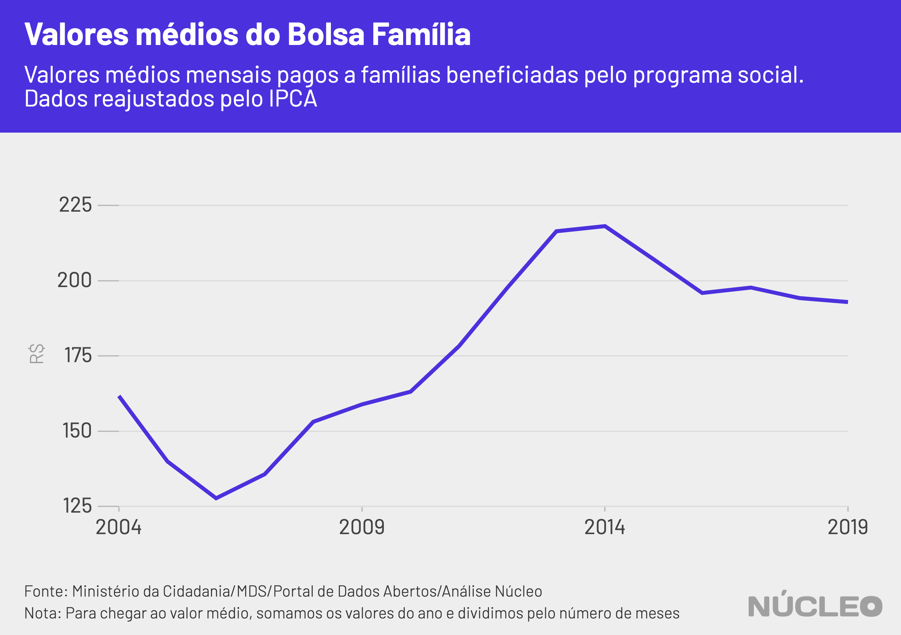
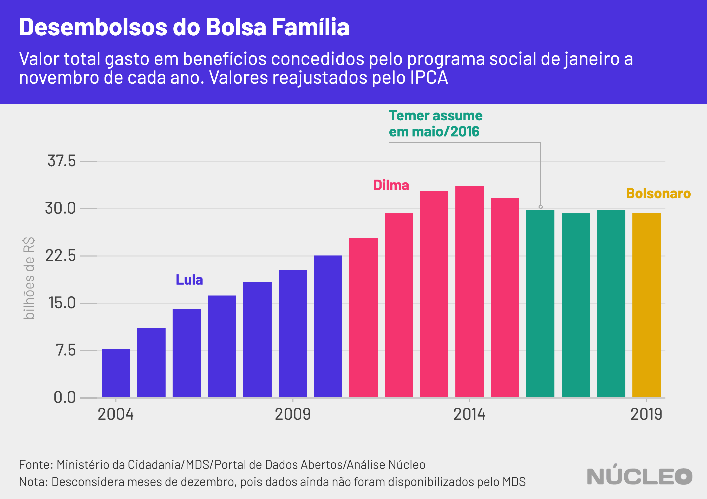
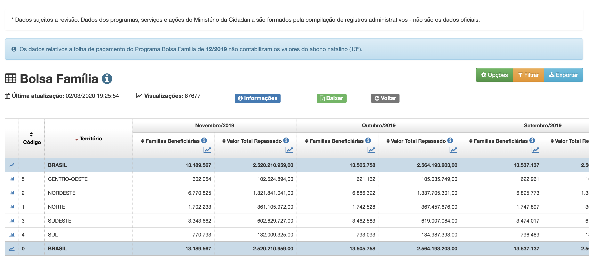

O [Bolsa Família](http://www.desenvolvimentosocial.gov.br/servicos/bolsa-familia/) é o maior programa social do Brasil, com mais de 13 milhões de famílias beneficiadas. Desde o começo do ano, reportagens de veículos como El País, Folha de S.Paulo e Estado de S.Paulo (links abaixo) têm demonstrado indícios de enxugamento do programa, com aumento da fila para aqueles que buscam receber um valor médio de cerca de R$190/mês.

O **Núcleo** analisou dados do Ministério da Cidadania atualizados até novembro de 2019 e constatou que houve queda no número de beneficiários do programa nesse ano na ordem de 7,3% na comparação com novembro de 2018.

---

###### É importante porque...

- *O Bolsa Família é o maior programa social do Brasil*

- *Milhões de famílias estão na fila para receber o benefício*

- *Aperto fiscal pode estar prejudicando concessão de novos benefícios*

---

No total, em 2019, houve um corte de na faixa de 1% no número médio anual de benefícios – volume significativo, mas ainda assim menor do que um enxugamento de 3% em 2017 sobre o ano anterior, durante o governo de Michel Temer, e um pouco menor do que a redução de 1,3% em 2015 ante 2014, no começo do segundo mandato de Dilma Rousseff.

Os dados oficiais podem ser encontrados no [Portal de Dados Abertos do governo federal](http://www.dados.gov.br/dataset/bolsa-familia-misocial). Não foram divulgados, até 02.mar.2020 dados sobre dezembro de 2019 -- o mês foi retirado dessa conta, para tornar todos os anos comparáveis sem levar em conta possível sazonalidade do último mês do ano.

| data   | milhõs de famílias |
|--------|--------------------|
| Nov.18 | 14,23              |
| Dez.18 | 14,14              |
| Jan.19 | 13,76              |
| Fev.19 | 13,91              |
| Mar.19 | 14,11              |
| Abr.19 | 14,13              |
| Mai.19 | 14,34              |
| Jun.19 | 14,07              |
| Jul.19 | 13,84              |
| Ago.19 | 13,83              |
| Set.19 | 13,54              |
| Out.19 | 13,51              |
| Nov.19 | 13,19              |

---

###### Na imprensa

* [Governo Bolsonaro não explica tamanho real da fila do Bolsa Família](https://brasil.elpais.com/brasil/2020-01-31/governo-bolsonaro-nao-explica-tamanho-real-da-fila-do-bolsa-familia.html) &sdot; *El País* &sdot; (31/01/2020)

* [Bolsonaro trava Bolsa Família em cidades pobres e fila chega a 1 milhão](https://www1.folha.uol.com.br/mercado/2020/02/bolsonaro-trava-bolsa-familia-em-cidades-pobres-e-fila-chega-a-1-milhao.shtml?origin=folha) &sdot; *Folha de S.Paulo* &sdot; (10/02/2020)

* [Governo Bolsonaro fecha porta e reduz em 75% reingressos ao Bolsa Família](https://www1.folha.uol.com.br/mercado/2020/02/governo-bolsonaro-fecha-porta-e-reduz-em-75-reingressos-ao-bolsa-familia.shtml) &sdot; *Folha de S.Paulo* &sdot; (15/02/2020)

* [Fila do Bolsa Família já tem 3,5 milhões de pessoas; municípios voltam a dar cesta básica](https://politica.estadao.com.br/noticias/geral,fila-do-bolsa-familia-ja-tem-3-5-milhoes-de-pessoas-municipios-voltam-a-dar-cesta-basica,70003201822) &sdot; *O Estado de S.Paulo* &sdot; (18/02/2020)

* [Há um ano, governo já sabia da falta de dinheiro para o Bolsa Família](https://www.poder360.com.br/midia/brasil-ve-midia-digital-crescer-e-331-veiculos-jornalisticos-serem-extintos/) &sdot; *Folha de S.Paulo* &sdot; (26/02/2020)

* [Governo Bolsonaro descumpre Lei de Acesso à Informação e não responde sobre Bolsa Família](https://brasil.elpais.com/politica/2020-03-02/governo-bolsonaro-descumpre-lei-de-acesso-a-informacao-e-nao-responde-sobre-bolsa-familia.html) &sdot; *El País* &sdot; (02/03/2020)

---

No interativo abaixo, conseguimos ver com clareza toda a evolução do Bolsa Família, desde 2004, quando os benefícios começaram a ser concedidos.

Durante o governo Lula houve uma considerável evolução, especialmente a partir de 2006, à medida que o programa crescia. Se considerarmos que durante o mandato de Lula o Bolsa Família ainda estava se consolidando em todo o país, no começo do governo de Dilma Rousseff o benefício ultrapassou 13 milhões de famílias pela primeira vez.

A partir de 2014, no entanto, possivelmente por conta da crise econômica brasileira, começou a haver um enxugamento. No governo de Michel Temer houve [a maior redução](https://noticias.uol.com.br/cotidiano/ultimas-noticias/2017/08/11/bolsa-familia-reduz-543-mil-beneficios-em-1-mes-programa-tem-maior-corte-da-historia.htm) no programa até então, seguida de uma retomada de benefícios.

O governo de Jair Bolsonaro, por sua vez, assumiu em janeiro de 2019 com quase 14 milhões de famílias beneficiadas, e encerrou novembro com cerca de 570 mil famílias a menos.

<i class="far fa-hand-pointer"></i> <small><em>Clique nos botões para trocar o gráfico</em></small>

  <button class="active botao" onclick="changeimg('https://live.staticflickr.com/65535/49609800902_93b7b989f5_b.jpg',this);">Série Histórica Completa
  </button>
  <button class="botao" onclick="changeimg('https://live.staticflickr.com/65535/49609028468_516f11c84d_b.jpg',this);">Série a partir de 2011
  </button>
  <button class="botao" onclick="changeimg('https://live.staticflickr.com/65535/49609544586_b4f941da92_b.jpg',this);">Série de 2019
</button>

  

    
  

### VALORES FINANCEIROS

Ao ajustarmos os dados pela inflação, conseguimos ver ganhos consideráveis nos benefícios concedidos a partir de 2006. Mas, novamente, durante o auge da crise, os valores médios começaram a cair paulatinamente a partir de 2014, para um patamar de cerca de R$190 por benefício.

Assim como a média dos benefícios pagos, os valores totais desembolsados pelo governo de janeiro a novembro também começaram a cair a partir de 2014. No caso do governo Bolsonaro, o total desembolsado estava bem em linha com os três anos imediatamente anteriores.

### METODOLOGIA

O **Núcleo** baseou todas as suas análises em dados fornecidos diretamente pelo Ministério da Cidadania, sob a rubrica do Ministério do Desenvolvimento Social. Essas informações foram obtidas diretamente da API tal como disponibilizada no [Portal de Dados Abertos do governo federal](http://www.dados.gov.br/dataset/bolsa-familia-misocial), que contém valores e números de famílias agrupados por município.

Nessa API ainda não constam dados de dezembro de 2019 (ver print abaixo), motivo pelo qual esse mês foi desconsiderado nas análises, a fim de evitar distorções por conta de possíveis, embora não imediatamente averiguadas, características sazonais do último mês do ano.

#### [link para página acima](http://bit.ly/2uL1KXh)

A extração dos dados e as análises foram feitas utilizando a linguagem de programação R, e os códigos podem ser encontrados integralmente [neste link](https://gist.github.com/voltdatalab/c68c1fa1e2c23e97c9ef1e69f296952a).

Por termos feito apenas uma descrição dos dados encontrados, sem chegar a conclusões nem juízos, o Núcleo não entrou em contato com o governo para pedir esclarecimentos. Se governo, organizações ou pessoas desejarem enviar algum esclarecimento acerca desses dados, favor contatar os editores no email [nucleo@voltdata.info](mailto:nucleo@voltdata.info).

Essa reportagem *pode* ser atualizada caso os dados de dezembro de 2019 sejam publicados.

