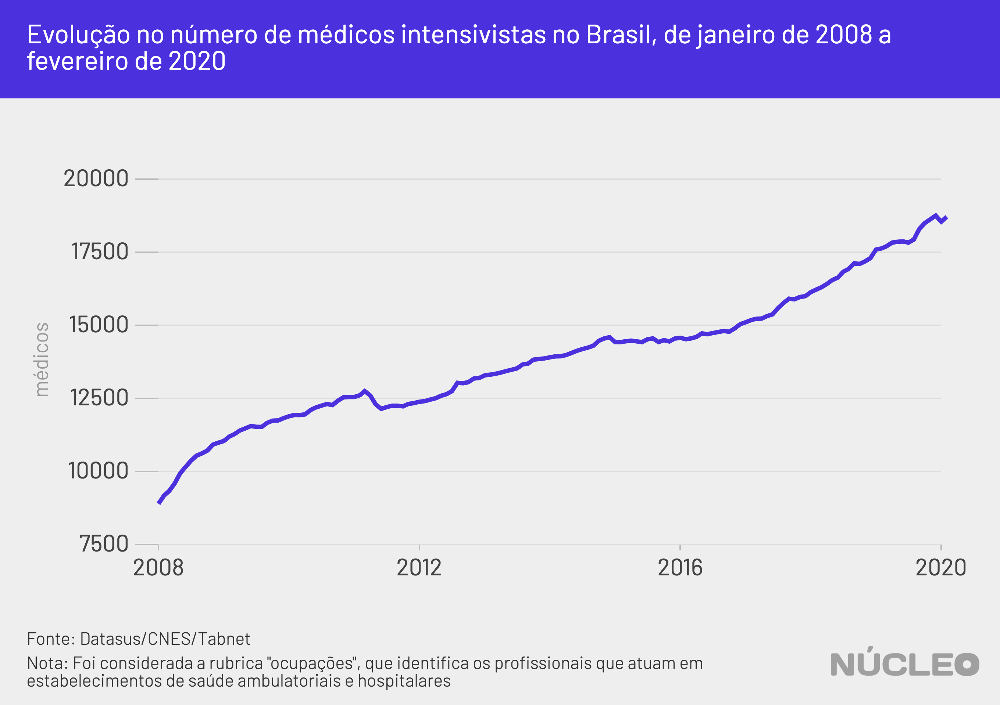

À medida que o coronavírus se espalha pelo Brasil e coloca pressão sobre a capacidade do sistema de saúde, o número de médicos especializados em tratamento intensivo nas UTIs brasileiras pode ser insuficiente para dar conta da demanda por emergência, agravando a situação de falta de leitos e respiradores disponíveis.

O Brasil possui 18.716 profissionais com capacitação de terapia intensiva em atividade em ambulatórios e hospitais, segundo dados de fevereiro deste ano. O número é mais do que o dobro de 12 anos atrás, de acordo com levantamento do Núcleo com [dados](http://tabnet.datasus.gov.br/cgi/tabcgi.exe?cnes/cnv/prid02br.def) do Cadastro Nacional de Estabelecimentos de Saúde (CNES).

Para Cristiano Franke, médico intensivista do Hospital de Pronto Socorro de Porto Alegre e membro da Associação de Medicina Intensiva Brasileira (AMIB), esse número de profissionais não é suficiente para um cenário de crise que o país enfrenta pela epidemia de coronavírus.

---

###### É importante porque...

- *A epidemia de coronavírus deve testar limites do sistema de saúde brasileiro*

- *Caso a epidemia se espalhe, podem faltar médicos especializados em UTI*

---

#### [Acesse aqui dados em tempo real sobre a pandemia - via Johns Hopkins University](https://coronavirus.jhu.edu/map.html?fbclid=IwAR3e_CRbLWn8AcfGIyS_owIO1CXiCBUgjFXe7MnjxKoDEaSKm7P5ss_0uko)

Um médico intensivista pode cuidar, em seu turno, de no máximo 10 pacientes, número que pode cair dependendo da complexidade da situação.

O Brasil tinha cerca de 3.000 casos confirmados de COVID-19 até a tarde do dia 26 de março. Uma projeção da Agência Brasileira de Inteligência (ABIN), [revelada](https://theintercept.com/2020/03/24/coronavirus-abin-projeta-mortes/) pelo site Intercept, [mostrou](https://theintercept.com/document/2020/03/24/abin-2303/) que o contágio pode chegar a 35 mil brasileiros ao fim de março. Ainda há subnotificação de [diagnósticos](https://oglobo.globo.com/sociedade/coronavirus/registros-de-coronavirus-no-brasil-sao-subestimados-sugere-estudo-1-24331652) por falta de testes, então o número deve ser muito maior.

"Numa situação de desastre, catástrofe -- e uma pandemia é uma situação dessas, em que se demanda maior necessidade de recursos do que a gente tem a ofertar -- no Brasil não há profissionais de terapia intensiva para cuidar de todos os doentes", disse o especialista.

Segundo Franke, que é coordenador do Curso de Fundamentos de Gerenciamento de Desastres da Amib, existe a possibilidade de se "arrecadar" profissionais de outras áreas para ficarem sob supervisão de médicos intensivistas, algo que ele disse que já começou a acontecer em hospitais maiores.

Uma UTI conta com a colaboração de diversas categorias de serviço de saúde, incluindo, além de médicos e enfermeiros, fisioterapeutas, profissionais de apoio psicológico e nutricionistas, acrescentou Franke. "Várias especialidades são importante nessa situação de catástrofe." O número de enfermeiros intensivistas cadastrados no CNES cresceu apenas 16% desde 2008, para 2.815 profissionais.

> "Faltam profissionais de terapia intensiva para cobrir com o cuidado adequado os pacientes críticos".  
- Cristiano Franke, médico e coordenador do Curso de Fundamentos de Gerenciamento de Desastres da Amib

A possível falta de médicos intensivistas no Brasil em meio à epidemia de coronavírus se soma à também possível [carência](https://br.noticias.yahoo.com/coronav%C3%ADrus-com-poucos-leitos-uti-232148470.html) de leitos para até 42 mil brasileiros, segundo [um estudo](https://proqualis.net/sites/proqualis.net/files/Cen%C3%A1rios%20para%20a%20demanda%20vs%20oferta%20de%20leitos%20de%20UTIs%20e%20respiradores%20na%20epidemia%20COVID-19%20no%20Brasil.pdf). Além disso, o Brasil [perdeu quase](https://nucleo.jor.br/pol%C3%ADticas%20p%C3%BAblicas/2020-03-12-coronavirus-capacidade-hospitalar-brasil) 50 mil leitos de internação hospitalar regular desde 2007.

"Em nosso país, os leitos de UTI são insuficientes para a demanda de uma pandemia e, ainda mais preocupante, apresentam-se distribuídos de forma irregular, deixando grande parte da população nacional sem a menor chance de ter acesso à assistência devida", disse a AMIB em [nota](https://www.amib.org.br/noticia/nid/nota-de-esclarecimento-sobre-o-pronunciamento-oficial-do-presidente-da-republica-jair-bolsonaro-de-24032020-sobre-a-pandemia-de-covid-19/) datada de 25 de março, após [pronunciamento](https://www.youtube.com/watch?v=Vl_DYb-XaAE) do presidente Jair Bolsonaro.

O Ministro da Saúde, Luiz Henrique Mandetta, previu para o fim de abril um [colapso](https://agenciabrasil.ebc.com.br/saude/noticia/2020-03/sistema-de-saude-pode-entrar-em-colapso-em-abril-diz-ministro-da-saude) no sistema de saúde do Brasil, sendo depois [desmentido](https://economia.uol.com.br/noticias/reuters/2020/03/22/bolsonaro-nega-colapso-na-saude-por-coronavirus-e-diz-que-ministro-mandetta-exagerou.htm) por Bolsonaro.

### METODOLOGIA

O **Núcleo** recorreu a dados do Ministério da Saúde, no [sistema Tabnet](http://www2.datasus.gov.br/DATASUS/index.php?area=0204), do Datasus. Foram analisados dados agregados para todo o país do Cadastro Nacional de Estabelecimentos de Saúde (CNES) relativos a:

- **CNES - RECURSOS HUMANOS - OCUPAÇÕES - SEGUNDO CBO 2002 - BRASIL.**

Segundo notas metodológicas, essa tabela "identifica os profissionais que atuam em estabelecimentos de saúde ambulatoriais e hospitalares." Dados sob a rubrica "Profissinais" estavam subdimensionados.
