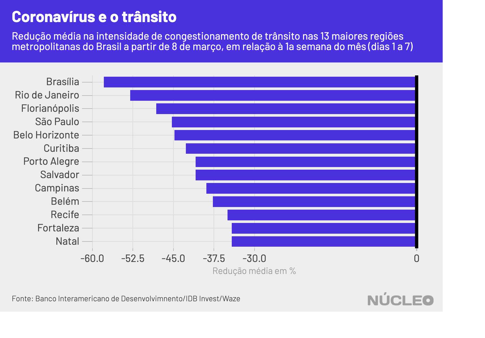

O congestionamento médio de veículos nas 24 maiores regiões metropolitanas do Brasil caiu quase pela metade a partir da segunda semana de março, em um momento no qual todo o país passa por medidas de isolamento e fechamento de comércio para combater a epidemia de coronavírus.

Análise com [dados](https://www.iadb.org/en/topics-effectiveness-improving-lives/coronavirus-impact-dashboard) disponibilizados pelo Banco Interamericano de Desenvolvimento/IDB Invest mostra um declínio médio de 41,7% na intensidade de congestionamento de trânsito (TCI, na sigla em inglês) nas maiores cidades do Brasil a partir de 8 de março até dia 28, em relação à primeira semana do mês (dias 1 a 7).

---

###### É importante porque...

- *Mostra os efeitos da epidemia e das medidas de contenção na circulação de pessoas e veículos*

- *Indica também menor atividade econômica*

---

O TCI mede tanto a extensão do trânsito quanto sua duração em um determinado espaço.

Essa queda nas regiões metropolitanas está em linha com a média de 24 países da América Latina, onde o TCI caiu 43,3% no mesmo período. No Brasil, em geral, considerando outras regiões, a intensidade do trânsito teve redução de 33,7%.

Na América do Sul, a maior queda apurada foi na Venezuela, seguida de Paraguai e Equador. Apenas o Uruguai teve uma queda menor do que a brasileira, mostrando que o Brasil tem sido mais lento em reduzir sua movimentação.

### METODOLOGIA

Os [dados](https://www.iadb.org/en/topics-effectiveness-improving-lives/coronavirus-impact-dashboard) são baseados em um convênio entre o Banco Interamericano de Desenvolvimento e o [programa](https://www.waze.com/en/ccp) "Waze for Cities".

Os gráficos desconsideram algumas cidades e países a fim de facilitar a visualização de dados.

As regiões metropolitanas consideradas na conta foram: Belém, Belo Horizonte, Brasília, Campinas, Curitiba, Florianópolis, Fortaleza, Goiânia, João Pessoa, Joinville, Maceió, Manaus, Natal, Porto Alegre, Recife, Rio de Janeiro, Salvador, Santos, São José dos Campos, São Luís, São Paulo, Sorocaba, Teresina e Vitória.

Os países considerados na conta foram: Argentina, Bahamas, Barbados, Belize, Bolívia, Brasil, Chile, Colômbia, Costa Rica, República Dominicana, Equador, El Salvador, Guatemala, Guiana, Haiti, Honduras, Jamaica, México, Nicarágua, Panamá, Paraguai, Peru, Suriname, Trinidad & Tobago, Uruguai e Venezuela.

A metodologia pode ser encontrada [neste documento](http://idbdocs.iadb.org/wsdocs/getdocument.aspx?docnum=EZSHARE-1350314980-529). Descrevendo o TCI (tradução do **Núcleo**):

_"Essa medida do TCI sumariza tanto a extensão dos congestionamentos na rede viária de um polígono (ex. uma região metropolitana) quanto sua duração, porque a continuidade de congestionamentos é contada cada vez dentro de um intervalo i. Por exemplo, se na região metropolitana A e na região metropolitana B as mesmas 10 linhas de congestionamento são formadas em um dia, cada uma com 150 metros de comprimento, teríamos uma medida de 1.500 metros de congestionamento tanto em A quanto em B durante o dia. No entanto, se congestionamentos em A têm uma duração que seja o dobro da duração de B, o TCI para A seria o dobro do TCI para B."_
