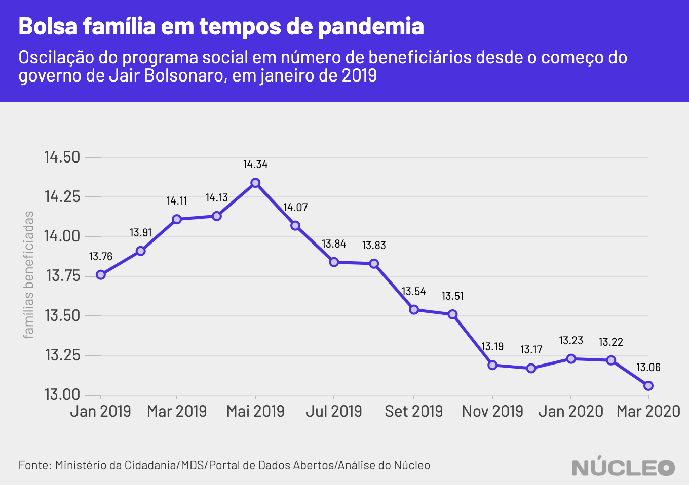
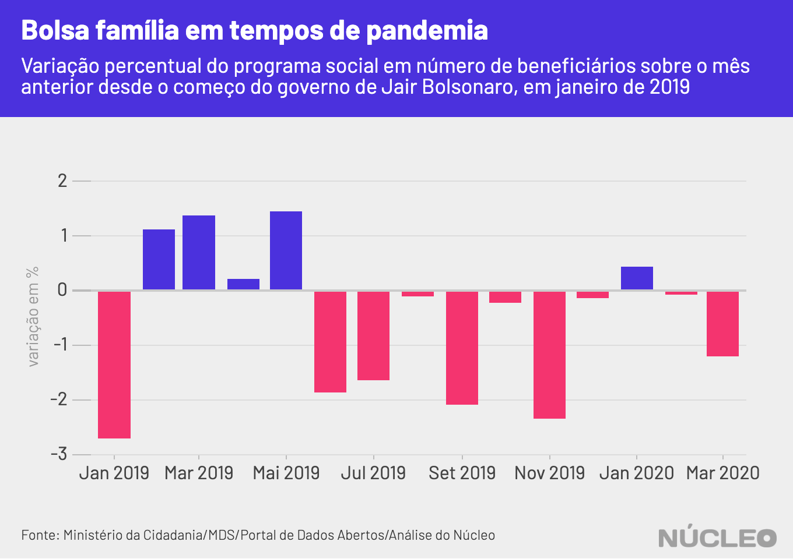

Em um momento crítico para o Brasil por conta de medidas de combate à epidemia de coronavírus, que têm levado a uma redução da atividade econômica do país, o número de beneficiários pelo Bolsa Família caiu 1,2% em março em relação a fevereiro -- uma redução de 158 mil famílias. Essa é a nona redução mensal em um ano no número recipientes do principal programa social do governo federal.

Uma análise do **Núcleo** constatou que, em fevereiro de 2020, o número de famílias beneficiadas em 5.570 municípios era de 13,21 milhões. Em março, esse montante caiu para 13,06 milhões. No comparativo anual, entre março de 2020 e o mesmo mês em 2019, a queda é de 7,5%, num total de cerca de 1 milhão de famílias.

---

###### É importante porque...

- *O Bolsa Família é o maior programa social do Brasil*

- *Em momento de isolamento social para combater a COVID-19, em que muitas pessoas não estão saindo para trabalhar, as famílias recipientes precisam de renda mais do que nunca*

---

O **Núcleo** consultou a API oficial do Bolsa Família oficial do Ministério da Cidadania nesta terça-feira, 31, e os [dados de março](http://aplicacoes.mds.gov.br/sagi/servicos/misocial?q=*&fq=anomes_s:2020*&fq=tipo_s:mes_mu&wt=csv&fl=ibge:codigo_ibge,anomes:anomes_s,qtd_familias_beneficiarias_bolsa_familia,valor_repassado_bolsa_familia&rows=10000000&sort=anomes_s%20asc,%20codigo_ibge%20asc) já constavam lá - mas ainda não [no site](https://aplicacoes.mds.gov.br/sagi/vis/data3/v.php?q[]=5ItjcmGJnfSh1aLB1MiFcoeVhX5hhoNzgIuIhJh2dHukfYXnybKys9%2B%2BsqilzpK4yca6q7DVybrMibllqHyigKm%2FudC0iLe6osWKpucSF63jsN11k66z2d3NurM2Asm3ycZTpqB5verfwKSm1K1zhMbNy69Qn7SvCAbEu8nFtIQ%3D).

| data       | famílias   | var. mes|
|------------|------------|---------|
| 2019-01-01 | 13.760.886 | -2.7    |
| 2019-02-01 | 13.914.330 | 1.12    |
| 2019-03-01 | 14.105.240 | 1.37    |
| 2019-04-01 | 14.134.323 | 0.21    |
| 2019-05-01 | 14.339.058 | 1.45    |
| 2019-06-01 | 14.072.368 | -1.86   |
| 2019-07-01 | 13.841.302 | -1.64   |
| 2019-08-01 | 13.826.716 | -0.11   |
| 2019-09-01 | 13.537.137 | -2.09   |
| 2019-10-01 | 13.505.758 | -0.23   |
| 2019-11-01 | 13.189.567 | -2.34   |
| 2019-12-01 | 13.170.607 | -0.14   |
| 2020-01-01 | 13.228.015 | 0.44    |
| 2020-02-01 | 13.216.880 | -0.08   |
| 2020-03-01 | 13.058.228 | -1.2    |

<figcaption>Fonte: <a href="http://aplicacoes.mds.gov.br/sagi/servicos/misocial?q=*&fq=anomes_s:2020*&fq=tipo_s:mes_mu&wt=csv&fl=ibge:codigo_ibge,anomes:anomes_s,qtd_familias_beneficiarias_bolsa_familia,valor_repassado_bolsa_familia&rows=10000000&sort=anomes_s%20asc,%20codigo_ibge%20asc"> API Ministério da Cidadania</a></figcaption>

É importante dizer que as medidas de isolamento social para contenção à epidemia de coronavírus começaram apenas a partir de meados de março, e seria improvável qualquer mudança de planejamento de última hora na concessão do Bolsa Família por parte do governo Bolsonaro, a fim de atenuar os efeitos da crise. Havia pouco tempo para mudanças em um programa tão grande.

No entanto, as repetidas quedas no número de famílias beneficiadas nos últimos 12 meses (houve alta apenas em abril e maio de 2019 e janeiro de 2020) mostram um enxugamento do programa em meio a políticas de ajuste fiscal da equipe econômica liderada pelo ministro Paulo Guedes, conforme [já mostrou](https://nucleo.jor.br/dinheiro%20p%C3%BAblico/2020-03-03-bolsa-familia-dados-2019) o **Núcleo** .

Vale notar que o programa sofre constantes alterações no número de beneficiários, com a finalidade de ajustes como a exclusão de [fraudes](https://g1.globo.com/politica/blog/valdo-cruz/post/2020/01/07/para-combater-fraudes-no-bolsa-familia-governo-quer-ter-acesso-a-ir-de-beneficiarios.ghtml), por exemplo.

A administração federal e o Congresso já trabalham [em medidas](https://g1.globo.com/economia/noticia/2020/03/24/coronavirus-veja-as-medidas-economicas-ja-anunciadas-pelo-governo-federal-e-pelo-bc.ghtml) para conter a crise, inclusive a [concessão](https://economia.uol.com.br/noticias/redacao/2020/03/30/senado-aprova-auxilio-de-r-600-a-trabalhadores-informais-por-tres-meses.htm) de auxílios de R$600 para trabalhadores autônomos ou informais.

Bolsonaro tem repetidamente [pedido](https://g1.globo.com/politica/noticia/2020/03/24/bolsonaro-pede-na-tv-volta-a-normalidade-e-fim-do-confinamento-em-massa.ghtml) pela volta à normalidade no cotidiado das pessoas, contrariando a Organização Mundial da Saúde, especialistas e até mesmo seu Ministério da Saúde, que busca manter ativas medidas drásticas de contenção à epidemia, como o chamado isolamento social, o qual resultou no fechamento do comércio e de escritórios, deixando muitas pessoas em suas casas e reduzindo, assim, a atividade econômica do país.

---

###### Na imprensa

* [Governo Bolsonaro não explica tamanho real da fila do Bolsa Família](https://brasil.elpais.com/brasil/2020-01-31/governo-bolsonaro-nao-explica-tamanho-real-da-fila-do-bolsa-familia.html) &sdot; *El País* &sdot; (31/01/2020)

* [Bolsonaro trava Bolsa Família em cidades pobres e fila chega a 1 milhão](https://www1.folha.uol.com.br/mercado/2020/02/bolsonaro-trava-bolsa-familia-em-cidades-pobres-e-fila-chega-a-1-milhao.shtml?origin=folha) &sdot; *Folha de S.Paulo* &sdot; (10/02/2020)

* [Governo Bolsonaro fecha porta e reduz em 75% reingressos ao Bolsa Família](https://www1.folha.uol.com.br/mercado/2020/02/governo-bolsonaro-fecha-porta-e-reduz-em-75-reingressos-ao-bolsa-familia.shtml) &sdot; *Folha de S.Paulo* &sdot; (15/02/2020)

* [Fila do Bolsa Família já tem 3,5 milhões de pessoas; municípios voltam a dar cesta básica](https://politica.estadao.com.br/noticias/geral,fila-do-bolsa-familia-ja-tem-3-5-milhoes-de-pessoas-municipios-voltam-a-dar-cesta-basica,70003201822) &sdot; *O Estado de S.Paulo* &sdot; (18/02/2020)

* [Há um ano, governo já sabia da falta de dinheiro para o Bolsa Família](https://www.poder360.com.br/midia/brasil-ve-midia-digital-crescer-e-331-veiculos-jornalisticos-serem-extintos/) &sdot; *Folha de S.Paulo* &sdot; (26/02/2020)

* [Governo Bolsonaro descumpre Lei de Acesso à Informação e não responde sobre Bolsa Família](https://brasil.elpais.com/politica/2020-03-02/governo-bolsonaro-descumpre-lei-de-acesso-a-informacao-e-nao-responde-sobre-bolsa-familia.html) &sdot; *El País* &sdot; (02/03/2020)

---

### METODOLOGIA

O **Núcleo** baseou todas as suas análises em dados fornecidos diretamente pelo Ministério da Cidadania, sob a rubrica do Ministério do Desenvolvimento Social. Essas informações foram obtidas diretamente da API tal como disponibilizada no [Portal de Dados Abertos do governo federal](http://www.dados.gov.br/dataset/bolsa-familia-misocial), que contém valores e números de famílias agrupados por município.

É possível encontrar dados do Bolsa Família também no [Portal da Transparência](http://www.portaltransparencia.gov.br/beneficios/consulta?de=01%2F01%2F2020&ate=01%2F12%2F2020&ordenarPor=mesAno&direcao=desc) do governo federal.

A extração dos dados e as análises foram feitas utilizando a linguagem de programação R, e os códigos podem ser encontrados integralmente [neste link](https://gist.github.com/voltdatalab/c68c1fa1e2c23e97c9ef1e69f296952a).

Por termos feito apenas uma agregação dos dados oficiais disponibilizados, sem juízo de valor sobre por que o número de beneficiários caiu, o **Núcleo** não entrou em contato com o governo para pedir esclarecimentos. Se governo, organizações ou pessoas desejarem enviar algum esclarecimento acerca desses dados, favor contatar os editores no email [nucleo@voltdata.info](mailto:nucleo@voltdata.info).

Essa reportagem *pode* ser atualizada caso os dados sejam atualizados.
